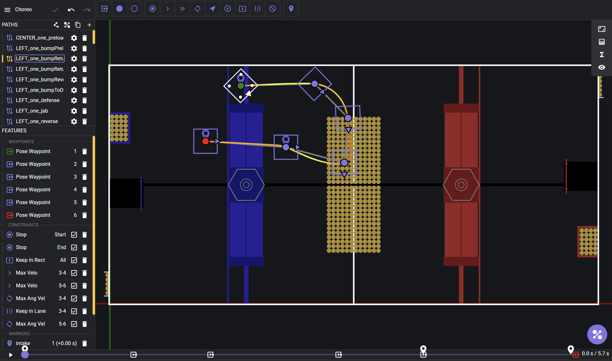

## Autonomous Paths
This folder is where all the paths that we made for autonomous pathing exist. Such paths were made using [Choreo](https://choreo.autos/), a path making software. Choreo is how we make all of our autonomous paths, and this year, we opted to make seperate paths, and chain them together for our routines.


### Example of one of our autons
```java
        addMultiAuton(kRightTrenchTwoCycleBumpReturn,
            new AdaptableAutonInfo(AutonK.kRightOneBumpReturn, AutonK.kSOTMTimeout, true, 0),
            new AdaptableAutonInfo(AutonK.kRightTwoBumpToTrench, AutonK.kSOTMTimeout, true, 0),
            new AdaptableAutonInfo(AutonK.kRightTwoBumpReturn, AutonK.kSOTMTimeout, true, 0),
            new AdaptableAutonInfo(AutonK.kRightTwoBumpToTrench, AutonK.kSOTMTimeout, true, 0),
            new AdaptableAutonInfo(AutonK.kRightTwoGoOut, AutonK.kSOTMTimeout, true, 0));
```
Note that we chain 5 paths together to create an auton, in which we run the RIGHT_one_bumpReturn, the RIGHT_two_bumpToTrench, the RIGHT_two_bumpReturn, followed by the RIGHT_two_bumpToTrench, finishing with the RIGHT_two_goOut. All of these paths exist as traj's in this folder, and that is where the code pulls from; such paths are, once again, made in choreo. So in order to make a new auton, you must make a plethora of new paths, and make it so that they chain together using the logic seen above.

### Example of one of our paths (LEFT_one_bumpReturn)

