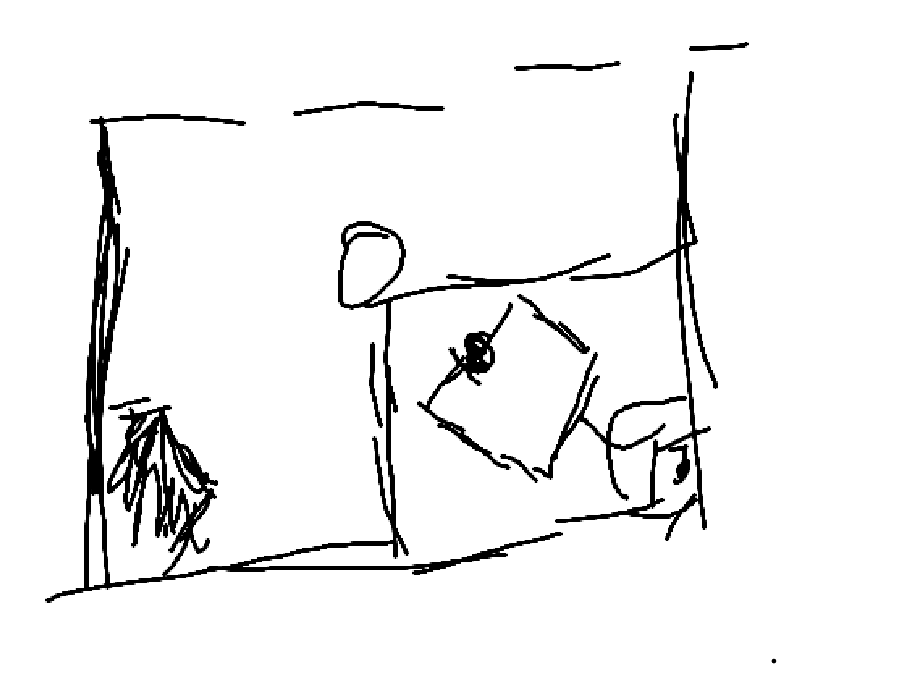

# How to reseed the LCM
- so the turret doesnt blow up even more :O

| Relevant Files |
| -------------- |
| `TurretK` in `Constants.java` |
| `Turret.java` |
| `Shooter.java` |

- If you're here, the turret wire has most likely lost its life in some way, shape or form.:(
    - <u>***FIRST***</u> disable the turret tracking!
        - this is in `Shooter.java`
        ```
        // set turret reference
        if (m_turret.isTurretHomed()) {
            var turretReference = calcData.turretReferenceRots();
            // set outputs
            var turretVelocityFF = calcData.turretCalcDetails().turretVelocityFF();
            if (m_turret.getTurretLocked()) {
                // m_turret.setTurretPos(m_turret.getTurretLockAngleRots(), 0.0);
                m_calcFlywheelVelocityRotPerSec = kShooterRPSd;
            } else {
                // NOT LOCKED
                if (m_turret.getHoldTurretAtIntake()) {
                    // m_turret.setTurretPos(Rotations.of(-0.250));
                } else {
                    // m_turret.setTurretPos(turretReference, turretVelocityFF);
                    m_calcFlywheelVelocityRotPerSec = kShooterRPSOverride.enabled()
                        ? kShooterRPSOverride.get()
                        : calcData.shooterReferenceRps();
                    if (kAllowDriverRPSTweak) { // ENABLE THIS TO ALLOW DRIVER RPS TWEAK
                        m_calcFlywheelVelocityRotPerSec += m_driverRPSTweak;
                        m_calcFlywheelVelocityRotPerSec = Math.clamp(m_calcFlywheelVelocityRotPerSec, 0, kShooterMaxRPSd);    //clamp here or clamp only when setShooterVel is called?
                    }
                }
            }
        }
        ```
        - notice how all the turret references are commented out, this ensures that all turret tracking is disabled and the wire wont kill itself
        - (all the `m_turret.setTurretpos()` NEED and i repeat <u>***NEED***</u> to be commented out)

    - <u>***NEXT***</u> open a tab of ***advantage scope*** and ***tunerx*** 
        - ensure that EncA is connected via tunerx, and EncB is connected via advantage scope
            - check `Turret/EncB/Conn`; if true, connected most likely (maybe confirm with chris/banks or other elec mentors to see if wired up correctly)
        - plot `Turret/EncA/Pos` and `Turret/EncB/Pos`
        - plot `Turret/LCMPos` and `Turret/positionRots`
            - once working, the two values should be in sync and be the same
    - open the `Turret Encoder A` device
        - press the ZERO CANCODER button 
        - 
        - take the new magnet offset and rewrite it into the `kEncAMagnetOffset` constant <u>***(MAKE SURE TO HIT THE APPLY BUTTON PLEASE DONT LET THAT BE THE REASON THE TURRET BREAKS)***</u>
        ```

        public static final double kLCMAtHomeRots = 0; // measure: turretLCMPos log value when turret is at home // 0.251; RETUNED 9/3/26
        public static final double kEncAMagnetOffset = 0.27001953125; // 0.320556640625; RETUNED 9/3/26
        public static final double kEncBOffset = 0.501; // measure: encB reading when turret is at encA=0  //0.529614; RETUNED 9/3/26 ;

        ```
        - then just follow the rest of the directions (surely you dont need my help even more)

    - for the kLCMAtHomeRots, place the turret in such a way that the wire is directly infront of the camera
        - 


