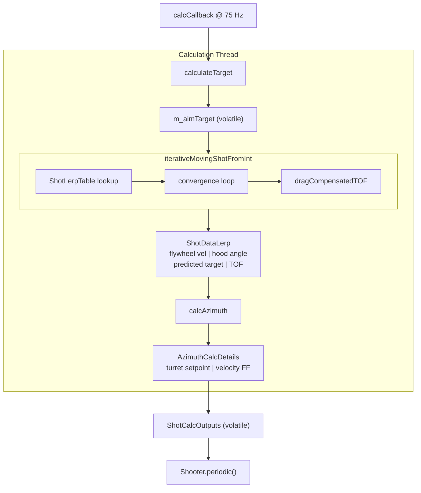

# /calc

This is where it all hit the fan :sob: :sob: :sob:

This folder handles all of the math that turns "robot is at this position going this fast" into "set flywheel to X RPS, hood to Y rotations, turret to Z degrees." It runs on a **background thread** at 75 Hz so none of this touches the main robot loop. Two classes: `ShooterCalc` coordinates everything and manages the thread, and `ShotCalculator` contains the actual ballistics: tables, physics, iterative moving-shot convergence, the whole deal.

---

## Files

- `ShooterCalc.java`: The orchestrator. Runs the background Notifier, determines which target to aim at, calls into `ShotCalculator` for shot parameters, computes turret azimuth, and stores results in volatile fields for `Shooter.periodic()` to read.
- `ShotCalculator.java`: Pure ballistics utility. Contains the interpolation tables, physics equations, and the iterative moving-shot algorithm. No state of its own (mostly static methods and final records).

---

## ShooterCalc.java

### Threading

`ShooterCalc` uses a WPILib `Notifier` to run `calcCallback()` at 75 Hz on a background thread:

```java
m_notifier.startPeriodic(Hertz.of(75)); // runs calcCallback() in a loop
```

Results are stored in `volatile` fields so `Shooter.periodic()` (running on the main thread) can safely read them without locking:

```java
private volatile ShotCalcOutputs m_shotCalcOutputs;
private static volatile Translation3d m_aimTarget;
private static volatile boolean m_isPassingFlag;
```

`Shooter.periodic()` caches the turret position into a `volatile double` at the top of every loop, and ShooterCalc reads this from its thread. This is intentional and noted in the code: do not move that cache line.

### What calcCallback() Does Every Cycle

1. Grabs the current `SwerveDriveState` from a thread-safe supplier.
2. Converts module states to field-relative `ChassisSpeeds`.
3. Determines the **target** via `calculateTarget()`.
4. Calls `calcShot()` to get flywheel speed, hood angle, and azimuth.
5. Logs everything.
6. Times itself and logs the loop duration.

### Target Selection: `calculateTarget()`

The robot shoots at different targets depending on where it is on the field:

```
Robot on own side of the hub -> SHOOTING MODE
  Target: enemy hub center (alliance-flipped appropriately)

Robot past the hub into neutral zone -> PASSING MODE
  Target: right by/on the bump
    - Robot left of field center -> left passing point
    - Robot right of field center -> right passing point
```

`m_isPassingFlag` is set/cleared here and read by `ShotCalculator` to select the right LERP table.

There's also a "no-passing zone" check (`robotInNoPassingZone`) that detects when the robot is near the opponent hub, where some passing angles may not be safe. The check uses field X/Y bounds and alliance color.
>We are not using this as of right now, as it somewhat screws with targeting

### Turret Azimuth: `calcAzimuth()`

Given a target position, robot pose, current turret heading, and field-relative chassis speeds, this computes the turret setpoint (in rotations) and a velocity feedforward.

1. **Compute turret pivot position**: offset the robot center by `kTurretOffsetX_m` and `kTurretOffsetY_m` using the robot's heading angle. Uses raw `cos/sin` to avoid allocations.

2. **Compute desired yaw**: `atan2` from turret pivot to target.

3. **Convert to turret-relative rotations**: subtract the turret's zero direction (robot heading + `kTurretAngleOffsetRad`), normalize to `[-0.5, 0.5]` rotations.

4. **Lateral bias compensation**: a sinusoidal correction applied based on the turret's angle relative to the robot:
   ```
   bias = gain * sin(turretAngleRelToRobot)
   ```
   This compensates for balls curving slightly left or right depending on which direction the turret is facing. Tunable via `/ShotCalc/lateralBiasGainRots`.

5. **Snapback**: if the turret is currently on the positive side of center (`turretHeadingRots > 0`) and `desiredAngle + 1` is still within max range, add 1 rotation to the setpoint. Same logic minus 1 on the negative side. This keeps the turret tracking through a target that would otherwise require crossing a hard stop.

6. **Velocity feedforward**: uses tangential velocity of the target relative to the turret pivot, minus robot rotational rate:
   ```
   tangentialVel = (toTargetX * vx - toTargetY * vy) / distance
   turretFFRadPerSec = tangentialVel / distance - omega
   ```

### Output Records

**`AzimuthCalcDetails`**: turret-specific outputs
- `turretReferenceRots`: final (snapback-safe) turret setpoint
- `turretVelocityFF`: feedforward in rad/s
- `turretX`, `turretY`: turret pivot in field coordinates (for logging)
- `fieldYawRad`: desired absolute yaw angle in radians
- `currentFieldYawRad`: current turret yaw in field coordinates
- `rawDesiredRotations`: pre-snapback angle (useful for debugging)

**`ShotCalcOutputs`**: everything `Shooter.periodic()` needs
- `turretCalcDetails`: the `AzimuthCalcDetails` record above
- `shotData`: `ShotDataLerp` with flywheel RPS, hood angle, TOF, and predicted target
- `turretReferenceRots`: pulled up from `turretCalcDetails` for convenience
- `hoodReferenceRots`: hood angle converted from radians to rotations
- `shooterReferenceRps`: flywheel speed converted from rad/s to RPS

---

## ShotCalculator.java

Pure ballistics. No threads, no state besides the static tables and tunable constants.

### Interpolation Tables: `ShotLerpTable`

WPILib's `InterpolatingDoubleTreeMap` allocates on every lookup (it uses `TreeMap`). `ShotLerpTable` is a zero-allocation sorted-array replacement:

- `keys[]`: distances in meters, sorted ascending
- `exitVels[]`: exit velocity in rad/s
- `hoodAngles[]`: hood angle in radians
- `tofs[]`: time of flight in seconds
- `drags[]`: drag coefficients

Lookup is a binary search + linear interpolation. No objects created on the hot path.

The Builder takes inputs in human-friendly units (rot/s, rotations) and converts to SI internally:
```java
shot.add(dist_m, rps, hoodRots, tof_s, drag);
// internally: rps * 2pi = rad/s, hoodRots * 2pi = radians
```

### Shot Tables

There are two active tables:

**`kShotTable`**: normal hub shots, 14 distance points from 0.985m to 8.627m
- Flywheel: ~39.8 to 68.8 RPS (raw values have a `kScoringRPSBoost` of -0.2 applied)
- Hood: 0 to 1.65 rad
- TOF: 0.5s at all distances (used for drag compensation math, not actual flight time)

**`kPassingTable`**: passing to alliance partners, 29 distance points from 4.008m to 14.355m
- Flywheel: ~48.75 to 105.14 RPS (`kRPSBoost` = +0.75 applied; `kLongRangeRPSBoost` = +0.35 for distances >= ~10.4m)
- Hood: ~0.70 to 1.16 rad
- TOF: 0.254s at all distances

### Iterative Moving-Shot: `iterativeMovingShotFromInterpolationMap()`

This is the core of shoot on the move. It converges on shot parameters that account for the robot moving during ball flight. Up to 8 iterations:

```
Start: table lookup at current distance to target

Each iteration:
  1. Apply drag-compensated drift time to compute predicted target position:
       driftT = (1 - e^(-c * tof)) / c   where c = drag coefficient (default 0.5)
       predX = targetX - vxLaunch * driftT
       predY = targetY - vyLaunch * driftT
  2. Recalculate distance to predicted position.
  3. Look up new flywheel speed, hood angle, TOF from table.
  4. Check convergence:
       |delta hood| < 0.05 rad
       |delta exitVel| < 0.5 rad/s
       |delta predPos| < 5mm
       |delta TOF| < 5ms
  5. If converged, break early.
```

`vxLaunch` and `vyLaunch` are the actual velocity of the turret pivot point, accounting for both robot linear velocity and rotational velocity (the turret pivot is offset from the robot center, so rotation contributes a tangential component).

The drag compensation is tunable via `/ShotCalc/sotmDragCoeff`. Setting it to 0 disables drag compensation entirely.

### Physics Utilities

**`calculateAngleFromVelocity()`**: projectile motion formula to find launch angle from exit speed and distance. Uses the full two-solution quadratic (`vel^4` under the root), picking the low-angle solution.

**`calculateTimeOfFlightSec()`**: simple horizontal flight time:
```
tof = distance / (velocity * cos(launchAngle))
where launchAngle = pi/2 - hoodAngle
```

**`calculateShotFromFunnelClearance()`**: 2D trajectory solver that finds the velocity and angle needed for a ball to simultaneously clear a funnel above the robot *and* land in the target funnel. Solves two simultaneous linear equations derived from parabolic motion, no iteration needed, closed-form algebra. See the Desmos link in the comments if you want to visualize it.

**`getDistanceToTargetM()`**: zero-allocation hot-path version: takes raw doubles, manually applies the turret offset transform using precomputed `cos/sin`, returns Euclidean distance. Used everywhere on the critical path.

### Data Records

**`ShotData`**: base shot parameters
- `exitVelocity`: rad/s
- `hoodAngle`: radians
- `target`: `Translation3d` of the aim point

**`ShotDataLerp`**: extends `ShotData` with `tofSec`, the time of flight in seconds from the LERP table.

Both records have `acceptLogging()` methods that push their fields to NetworkTables.

### New Fuel Adjustment *(currently disabled)*

`kRPSReductionNeeded = false`. When enabled, a linear regression over `kReductionDistances`/`kReductionAmount` would compute a per-distance RPS reduction applied during table building. The idea was to slightly back off flywheel speed for certain fuel states. Not active.

---

## Tuning Reference

| NT Key | Default | What It Does |
|--------|---------|-------------|
| `/ShotCalc/sotmDragCoeff` | 0.5 | Drag coefficient for SOTM lateral compensation |
| `/ShotCalc/lateralBiasGainRots` | `kTurretLateralBiasGainRots` | Sinusoidal lateral bias correction gain for the turret|
| `Shooter/Calculator/RPSBoost` | 0.75 | Boost applied to passing table RPS |

All tunable via `WaltTunable`, enable in NT and set a value. Changes apply to the next calc cycle.

---

## Quick Data Flow

